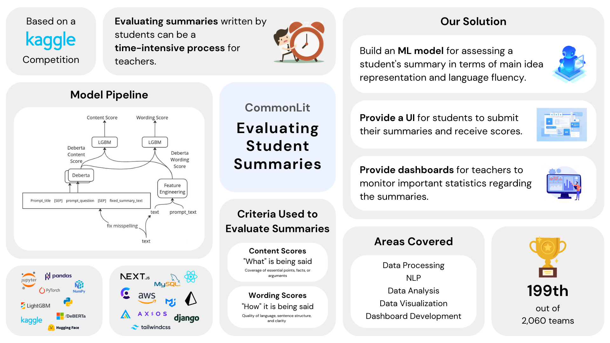

# Evaluating Student Summaries



## Background

This is the code repository of Group 14 for CS3501: Data Science and Engineering Project at University of Moratuwa.

### Problem Statement

This project aims to address the challenge of assessing the quality of summaries created by students in grades 3-12. The objective is to develop a model capable of objectively evaluating the effectiveness of student-written summaries in terms of capturing the core concepts and details of a source text, while also assessing the clarity, precision, and fluency of the language used in the summary.

## Tech Stack

- **Frontend**: Next.js 15, React 19, Material-UI
- **Backend**: Django 5.2, Django REST Framework
- **Database**: PostgreSQL 15
- **ML Models**: BERT, LightGBM
- **Deployment**: Vercel (Frontend), Docker (Database)

## Getting Started

### Prerequisites

- Node.js 18+ and npm
- Python 3.13
- Docker and Docker Compose
- pipenv (`pip install pipenv`)

### Installation

1. **Clone the repository**
   ```bash
   git clone https://github.com/Damika-Anupama/student-summary-evaluator.git
   cd student-summary-evaluator
   ```

2. **Setup Backend**
   ```bash
   cd backend
   pipenv install
   ```

3. **Setup Frontend**
   ```bash
   cd frontend
   npm install
   ```

4. **Setup Database**
   ```bash
   # From project root
   docker-compose up -d
   ```

5. **Configure Environment Variables**
   ```bash
   cd backend
   cp .env.example .env
   # Edit .env if needed
   ```

6. **Run Migrations**
   ```bash
   cd backend
   pipenv run python manage.py migrate
   ```

7. **Seed Database (Optional)**
   ```bash
   pipenv run python manage.py seed_data
   ```

### Running the Application

**Start Backend** (from backend directory)
```bash
pipenv run python manage.py runserver 8000
```

**Start Frontend** (from frontend directory)
```bash
npm run dev
```

**Access the application:**
- Frontend: http://localhost:3000
- Backend API: http://localhost:8000/api/

### API Endpoints

- `/api/text/` - Reading passages
- `/api/summaries/` - Student summaries
- `/api/assignments/` - Assignments
- `/api/students/` - Students
- `/api/teachers/` - Teachers
- `/api/summaryview/` - ML evaluation endpoint

## Project Structure

```
├── backend/              # Django backend
│   ├── backend/         # Project settings
│   ├── eval/            # Main app with models, views, serializers
│   ├── csv/             # Training data
│   └── manage.py
├── frontend/            # Next.js frontend
├── docker-compose.yml   # PostgreSQL setup
└── README.md
```

## Development

### Database Management

**Reset database:**
```bash
cd backend
pipenv run python manage.py migrate --fake eval zero
pipenv run python manage.py migrate
pipenv run python manage.py seed_data
```

**Create superuser:**
```bash
pipenv run python manage.py createsuperuser
```

**Access admin panel:** http://localhost:8000/admin/

## Deployment

The application is deployed at:
- Frontend: https://student-summary-evaluator.vercel.app

For production deployment instructions, see deployment documentation.
