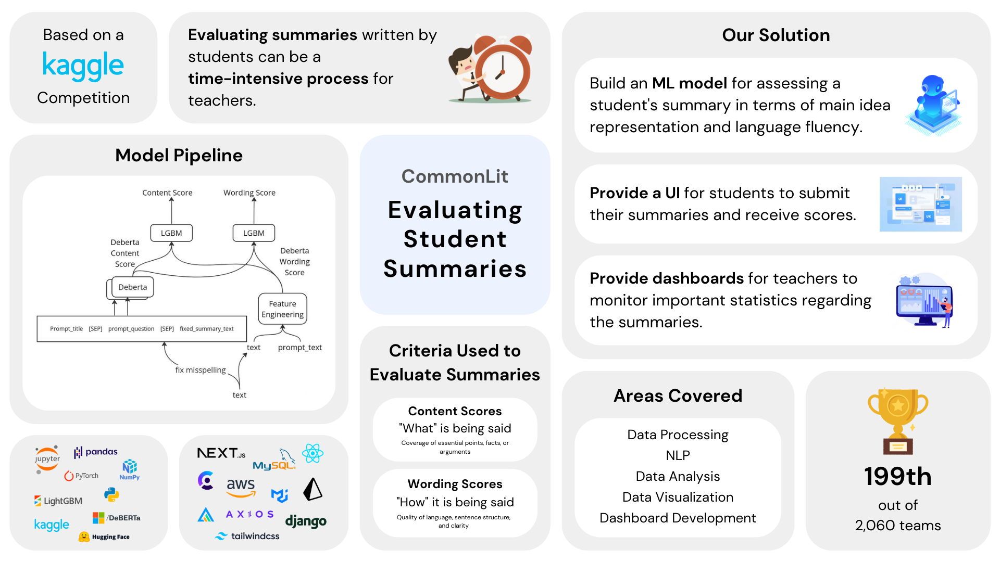

# Evaluating Student Summaries



> ### 🌐 Frontend Demo branch
> This is the **`frontend-demo`** branch — a self-contained, deployable version of the
> Next.js frontend that runs **with no Django backend, database, or API keys**. All data
> is served from in-app fixtures (`src/demo/demo-data.js`) via the Next.js API
> routes, so recruiters can click through a fully working teacher + student experience.
>
> - **Live demo:** https://student-summary-evaluator.vercel.app
> - **Deployment:** see [`DEPLOYMENT.md`](./DEPLOYMENT.md) (root-level Next.js app, deploys with defaults).
> - The complete Django + PostgreSQL + BERT/LightGBM implementation is maintained
>   in a private source repository. This public repository is a deploy-only demo mirror.

## Background

Code repository of Group 14 for CS3501: Data Science and Engineering Project at the
University of Moratuwa.

### Problem statement

The project assesses the quality of summaries written by students in grades 3–12 — how
well a summary captures the core concepts of a source text, and the clarity, precision,
and fluency of its language.

## What this demo shows

- **Teacher mission control** — smart summary, KPI cards with sparklines, live
  activity feed, needs-attention queue, cohort heatmap, **deep-linkable
  per-assignment analysis pages** with AI gap insights, and a **printable class
  report** (Save as PDF). Every analytical surface cross-links: heatmap rows
  open student profiles, columns open assignment pages.
- **Full assignment & roster management** — create, edit, and delete assignments;
  deadline status chips, a **per-assignment roster editor**, sortable tables, and
  **CSV import/export that round-trips** (Excel-safe: BOM-prefixed, and
  formula-injection guarded).
- **Teacher → student feedback loop** — leave a remark on any submission from the
  student profile drawer; the student sees it on their history next to the score.
- **Your changes stay put** — anything you create, edit or delete persists in the
  browser as an overlay on the fixtures, so it survives a reload. **Reset demo
  data** on Settings restores the shipped state.
- **Student experience** — a standing strip (average, submissions, to-dos),
  pick an assignment, write with a live word counter and **readability
  signal**, get instant content & wording scores with AI improvement
  suggestions and a **covered-vs-missed concept breakdown**, then track
  growth on a **score trend chart** with personal best and average. Results
  copy as plain text or as a **permalink that replays the exact result** —
  scoring is deterministic, so the link reproduces it. **One-click sample
  summaries** show the evaluator working without writing an essay first.
- **Working inbox & notifications** — unread badges, mark-as-read, all keyboard
  operable; every control in the demo does something real.
- **Polish throughout** — light/dark mode, ⌘K command palette, first-visit
  onboarding, mobile-safe layouts, skip-to-content + real heading structure, and
  statically served pages (~100ms loads). Demo dates self-refresh so the data
  always looks current.
- Use the **role switcher** (avatar menu or sidebar) to toggle between the teacher
  and student experiences.

## Tech stack

- **Framework**: Next.js 15, React 19
- **UI**: Material-UI (MUI 5), ApexCharts
- **Data (this branch)**: in-app fixtures served through Next.js API routes
- **ML / backend (private source)**: Django REST Framework, PostgreSQL, BERT, LightGBM

## Run locally

```bash
npm install --legacy-peer-deps
npm run dev
```

Then open http://localhost:3000. No environment variables or backend are required.

> `--legacy-peer-deps` is needed because the app pairs React 19 with MUI 5 / x-date-pickers 6.

## Testing

359 tests (Vitest + Testing Library) across 42 files cover the pure helpers
(score bucketing, deadline status, CSV building and parsing, pagination), the
demo API route handlers, and the interactive surfaces — the summary stepper,
score modal, cohort heatmap, roster editor, teacher remarks, and the
notification/message popovers:

```bash
npm test          # run once
npm run test:watch
```

CI in the private source repository runs the suite and a production build before
the sanitized demo is published here.

## Project structure

```
├── src/
│   ├── demo/demo-data.js   # all demo fixtures
│   ├── pages/              # routes (teacher + student) and API routes
│   ├── sections/           # dashboard widgets, tables, charts
│   ├── layouts/            # dashboard shell + role switcher
│   ├── theme/              # MUI theme (light/dark palette, components)
│   ├── utils/              # pure helpers + their unit tests (*.test.js)
│   └── tests/              # tests for pages and API routes — kept out of
│                           # src/pages, which Next.js would turn into routes
├── public/                 # static assets, robots.txt, sitemap.xml
├── vercel.json             # Vercel build config
├── DEPLOYMENT.md           # how to deploy this branch
└── img/
```
